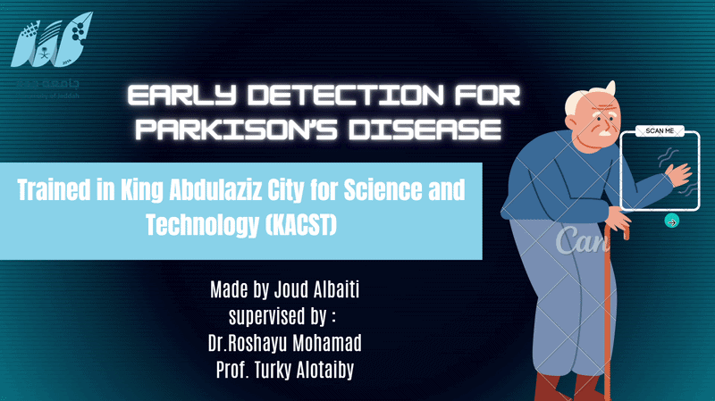

# Parkinson's Disease Severity Assessment from Finger Tapping



An AI-based system to assess Parkinson's disease (PD) motor severity from finger-tapping videos recorded via webcam. The system extracts biomechanical features from hand movements and predicts a severity score on the MDS-UPDRS scale (0–4).

This project was developed during a research internship at **King Abdulaziz City for Science and Technology (KACST)**, inspired by the methodology in Islam et al. (2023).

---

## How it works

```
Webcam video
     ↓
MediaPipe hand landmark detection (21 keypoints)
     ↓
Thumb–wrist–index angle tracking (frame by frame)
     ↓
Feature extraction: speed, amplitude, frequency, rhythm, hesitations
     ↓
LightGBM regressor → severity score 0–4
```

---

## Features extracted

The system computes biomechanical features aligned with MDS-UPDRS clinical guidelines:

- **Speed** — continuous finger-tapping velocity (degrees/second)
- **Amplitude** — maximum thumb–index angle per tap
- **Frequency** — taps per second and period statistics
- **Rhythm** — period entropy, aperiodicity, variance
- **Hesitations** — interruption count, freeze count, freeze duration
- **Wrist stability** — wrist movement magnitude (x, y, distance)

---

## Project structure

```
├── feature_extraction.py   # Real-time webcam feature extraction (MediaPipe)
├── train.py                # Model training with leave-one-patient-out CV
├── requirements.txt        # Dependencies
└── README.md
```

---

## Setup

```bash
pip install -r requirements.txt
```

### Run real-time feature extraction

```bash
python feature_extraction.py
```

Press `q` to stop the webcam and print the extracted features.

### Train the model

Download the dataset from the original paper's repository and place the CSV in the project folder, then:

```bash
python train.py
# or with a custom path:
python train.py --data path/to/features.csv
```

---

## Results

Evaluated using leave-one-patient-out cross-validation on the public dataset from Islam et al. (2023):

| Metric | This implementation | Original paper |
|--------|--------------------:|---------------:|
| MAE    | 0.60                | 0.58           |
| Model  | LightGBM            | LightGBM       |

---

## Requirements

- Python 3.8+
- OpenCV
- MediaPipe
- LightGBM
- scikit-learn
- pandas, numpy, scipy

---

## Citation

This project is inspired by and built upon the methodology described in:

> Islam, M.S., Rahman, W., Abdelkader, A. et al.  
> **Using AI to measure Parkinson's disease severity at home.**  
> *npj Digital Medicine* **6**, 156 (2023).  
> https://doi.org/10.1038/s41746-023-00905-9

---

## Acknowledgements

Developed during a research internship at KACST (King Abdulaziz City for Science and Technology), Riyadh, Saudi Arabia.  
Supervised by **Dr. Roshayu Mohamad** and **Prof. Turky Alotaiby**.
